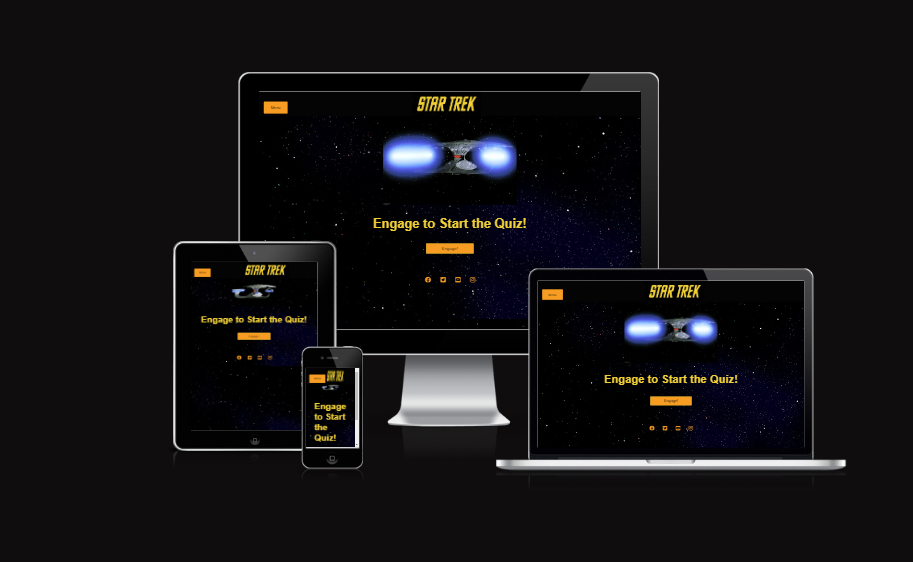
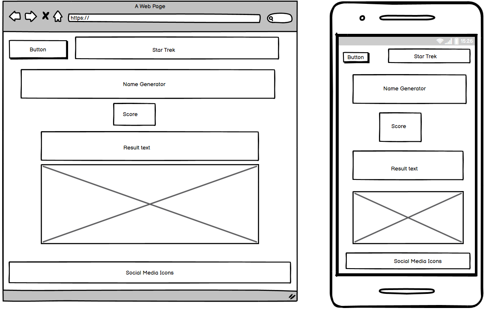
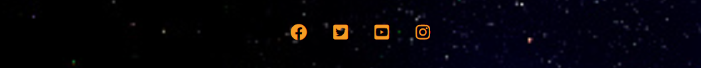
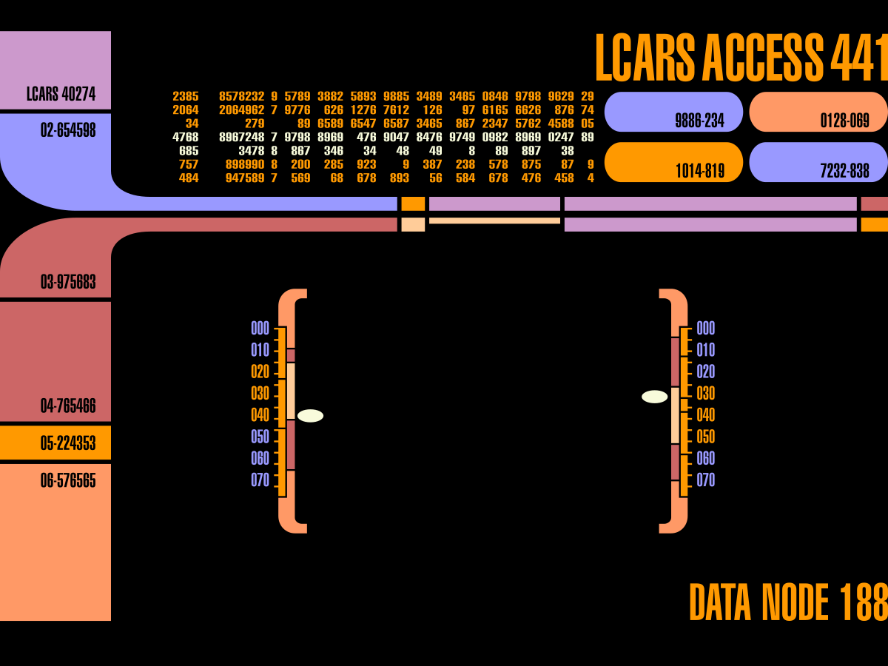
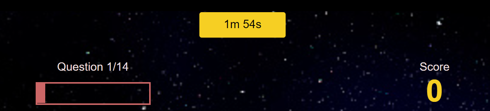
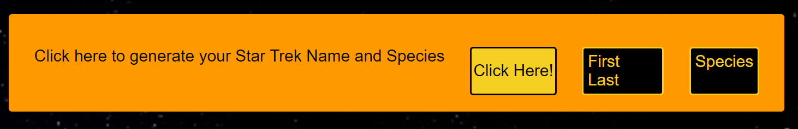
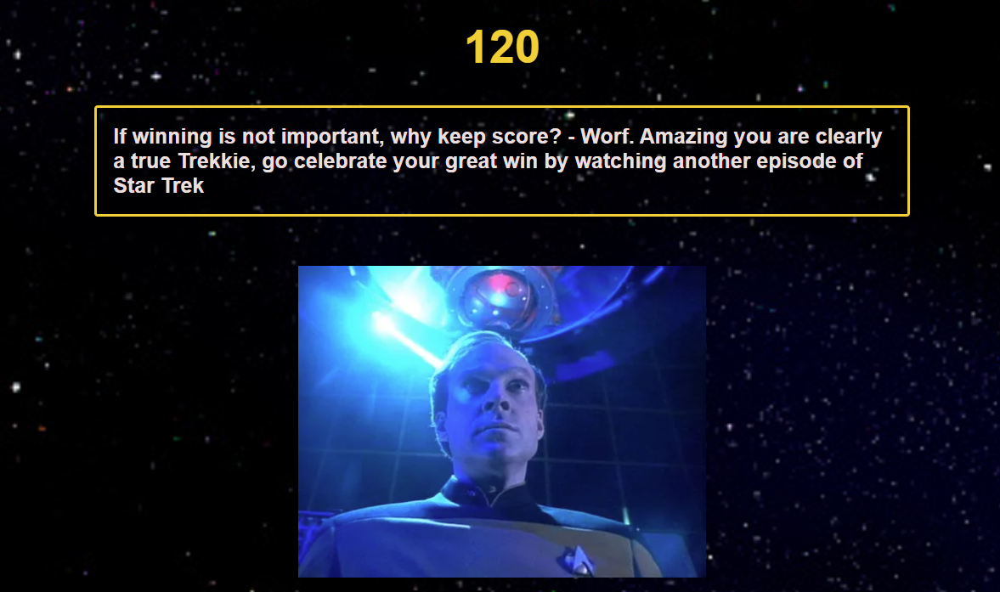

# Table of Contents

- [Purpose](#purpose)
    - [Target Audience](#target-audience)
- [User-Stories](#user-stories)
    - [First-Time-Visitor-Goals](#first-time-visitor-goals)
    - [Returning-Visitor-Goals](#returning-visitor-goals)
    - [Frequent-Visitor-Goals](#frequent-visitor-goals)
- [Design](#design)
    - [Colour-Scheme](#colour-scheme)
    - [Logo](#logo)
    - [Typography](#typography)
    - [Imagery](#imagery)
- [Wireframes](#wire-frames)
- [Features](#features)
    - [Existing-Features](#existing-features)
    - [Features-left-to-Implement](#features-left-to-implement)
- [Testing](#testing)
    - [Manual-Testing](#manual-testing)
    - [Issues-and-Resolutions](#issues-and-resolutions-found-during-testing)
    - [Lighthouse](#lighthouse-testing)
    - [Validator-Testing](#validator-testing)
- [Deployment](#deployment)
- [Credits](#credits)
    - [Content](#content)
    - [Media](#media)
    - [Code](#code)
    - [Technologies](#technologies)
- [Acknowledgements](#acknowledgements)
- [Disclaimer](#disclaimer)

# Star Trek Quiz

### Purpose
The Star Trek Quiz page is designed to be a fun quiz for those interested in Star Trek. It has a quiz that asks questions about the star trek shows. It gives the user a result at the end depending on their score and has a name generator that the user can click to get a random Star Trek name and species. 
As this website is designed for those interested in Star Trek the game page is designed to resemble one of the consoles from the enterprise. Along with using images from the show and the Star Trek logo for brand recognition.

Click the link to be directed to the live website:

# Target Audience
The target audience for this website are people who are looking for a fun online Star Trek quiz. It is geared towards people with an interest in Star Trek but anyone could enjoy the site.

# User Stories
### First Time Visitor Goals
As a first-time visitor I want to easily be able to understand the purpose of the site – eg that this is a quiz about Star Trek. I want to be able to easily navigate to the quiz page. I also want to get additional information on the show.

### Returning Visitor Goals
As a returning visitor I want to be able to take the quiz again to see if I can improve my score. I want to be able to go to the shows page and get more information on the shows. 

### Frequent Visitor Goals
As a frequent visitor I want to be able to check if there are new questions added to the quiz or name generator. Or any new feartures added in general.

# Design
### Colour scheme
Star Trek has a distinct colour scheme which I aimed to stick as closely to as possible. I have taken the main inspiration from the show The Next Generation (As the shows do vary slightly in their styling and this is my personal favourite and the most recognisable). My aim was to have the quiz resemble a console from TNG as closely as possible. 
The below image is a selection of the colours of the console screens in TNG and this is what I have selected from. 

Colors used -
- #ff9900
- #f6cf23
- rgba(0,0,0,0.2)
- rgba(107,107,178, 0.5)
- #cc6666
- #6b6bb2
- #cc99cc
- #28a745 
- #dc3545 

### Logo
For the website Logo I have used an image of the Star Trek Logo taken from the original series. This is a very recognisable font and logo which would draw the user’s interest and create instant brand recognition. 

### Text

### Imagery 
For the background of the main page, I have used an image of space and stars. It is fitting with theme of the website while also not being too busy and letting the text be the focus. The home page has a gif of the enterprise. The game page has imagery of a console from the enterprise to give the user the impression that they are playing the game on a star ship console. The end page uses various images of TNG depending on the score. 

# WireFrames

### Home

### Game

### End

# Features

## Existing Features

### Drop down Navigation bar and Logo
Featured on all four pages, the fully responsive navigation bar includes links to the Home page, Game page and shows page and is identical in each page to allow for easy navigation.
This section will allow the user to easily navigate from page to page across all devices without having to revert back to the previous page via the ‘back’ button.
Logo is featured on all four pages, it is the logo from the original Star Trek series and is used so that the user can recognise quickly what the site and quiz is about. The logo also creates brand recognition.
The Logo is also a link which if clicked will bring the user back to the home page, this is a standard in websites so is included as this will be what the user is expecting.

### The Footer
The footer section includes links to the relevant social media sites for the site owner.
The footer is valuable to the user as it encourages them to keep connected via social media.

### Main page image and button to start the game

The is the landing page. The gif is of the enterprise going to warp. The text instructs the user to click the engage button to start the quiz. This is a phrase used in TNG and would be familiar to those interested in star trek. It ties in with the image as Engage is what is said by the captain before the ship goes to warp. All of this should be entertaining to those familiar with Star Trek.

### Game page console images

I have surrounded the game in images of a console from the enterprise. This adds to the site giving it a futuristic look and makes the user feel as if they are taking the quiz on a console from Star Trek.

### Timer, Score and Question Counter Hub

This section of the game has a timer which counts down from two minutes, this gives the user a challenge as they need to answer all the questions in two minutes. It also get 10 seconds taken from it with each wrong answer. There is a question counter which increases with each question answered and also fills a bar. Finally there is the score counter which is increased by 10 points with every right answer.

### Questions and Answers

This is the section of the game where the user can see the question and they can select their answer. If they select the correct answer the answer turns green if its wrong it turn red.

### Name Generator

When the user finishes the quiz they are directed to the end page. The first thing on the page is a small name and species generator. The user can click the button to generate a random first name, last name and species from the Star Trek shows. 

### Score, result text and Image

### Play Again, Go Home

This is located at the end of the page it gives the user the option to either play the game again or to be directed back to the landing page.

# Testing

### Lighthouse

- Home page

- Game page

- End page 

# Deployment

Using Github Pages
The site was deployed to GitHub pages. The steps to deploy are as follows:
In the GitHub repository, navigate to the Settings tab
From the source section drop-down menu, select the Main Branch
Once the Main branch has been selected, the page will be automatically refreshed with a detailed ribbon display to indicate the successful deployment.
I then had to wait a few minutes until the site was fully deployed and it was ready.
The live link can be found here - 

Run Locally
Navigate to the GitHub Repository:
Click the Code drop down menu.
Either Download the ZIP file, unpackage locally and open with IDE (This route ends here) OR Copy Git URL from the HTTPS dialogue box.
Open your development editor of choice and open a terminal window in a directory of your choice.
Use the 'git clone' command in terminal followed by the copied git URL.
A clone of the project will be created locally on your machine.

# Disclaimer
This website is for educational purposes only.
