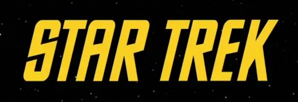
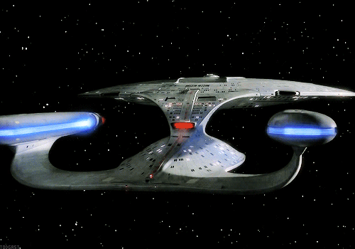
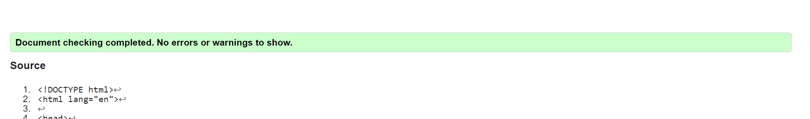
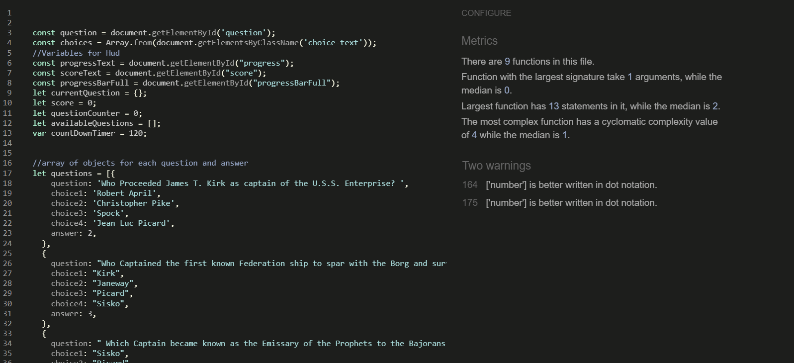

# Table of Contents

- [Purpose](#purpose)
    - [Target Audience](#target-audience)
- [User-Stories](#user-stories)
    - [First-Time-Visitor-Goals](#first-time-visitor-goals)
    - [Returning-Visitor-Goals](#returning-visitor-goals)
    - [Frequent-Visitor-Goals](#frequent-visitor-goals)
- [Design](#design)
    - [Colour-Scheme](#colour-scheme)
    - [Logo](#logo)
    - [Typography](#typography)
    - [Imagery](#imagery)
- [Wireframes](#wire-frames)
- [Features](#features)
    - [Existing-Features](#existing-features)
    - [Features-left-to-Implement](#features-left-to-implement)
- [Testing](#testing)
    - [Manual-Testing](#manual-testing)
    - [Lighthouse](#lighthouse-testing)
    - [Validator-Testing](#validator-testing)
    - [Fixed Bugs](#bugs)
    - [Unfixed Bugs](#bugs)
- [Deployment](#deployment)
- [Credits](#credits)
    - [Content](#content)
    - [Media](#media)
    - [Code](#code)
    - [Technologies](#technologies)
- [Acknowledgements](#acknowledgements)
- [Disclaimer](#disclaimer)

# Star Trek Quiz

### Purpose
The Star Trek Quiz page is designed to be a fun quiz for those interested in Star Trek. It has a quiz that asks questions about the star trek shows. It gives the user a result at the end depending on their score and has a name generator that the user can click to get a random Star Trek name and species. 
As this website is designed for those interested in Star Trek the game page is designed to resemble one of the consoles from the enterprise. Along with using images from the show and the Star Trek logo for brand recognition.

Click the link to be directed to the live website: https://griffinsar.github.io/Project-Two--Trek-Quiz/index.html

# Target Audience
The target audience for this website are people who are looking for a fun online Star Trek quiz. It is geared towards people with an interest in Star Trek but anyone could enjoy the site. The questions are tough but general enough that it can be played by those who know a lot about Trek and those new to the series. The shows page also gives a small bit of history on each show and lists them all which could be helpful for a new fan.

# User Stories
### First Time Visitor Goals
As a first-time visitor I want to easily be able to understand the purpose of the site – eg that this is a quiz about Star Trek. I want to be able to easily navigate to the quiz page. I also want to get additional information on the show.

### Returning Visitor Goals
As a returning visitor I want to be able to take the quiz again to see if I can improve my score. I want to be able to go to the shows page and get more information on the shows. 

### Frequent Visitor Goals
As a frequent visitor I want to be able to check if there are new questions added to the quiz or name generator. Or any new feartures added in general.

# Design
### Colour scheme
Star Trek has a distinct colour scheme which I aimed to stick with as closely to as possible. I have taken the main inspiration from the show The Next Generation (As the shows do vary slightly in their styling and this is my personal favourite and the most recognisable). My aim was to have the quiz resemble a console from TNG. And so I based my colours on this and also on the Logo image.
The below image is of the console screens in TNG and this is what I have selected my colours from. 

Colors used -
- #ff9900
- #f6cf23
- rgba(0,0,0,0.2)
- rgba(107,107,178, 0.5)
- #cc6666
- #6b6bb2
- #cc99cc
- #28a745 
- #dc3545 

### Logo
For the website Logo I have used an image of the Star Trek Logo taken from the original series. This is a very recognisable font and logo which would draw the user’s interest and create instant brand recognition. 

### Text

The font used in this site is : Arial, Helvetica, sans-serif;
The font is similar in style to the fonts used in the console images and so ties in nicely with this image. It gives the site a cohesive look. I believe a busier looking font would detract from the game and design of the pages.

### Imagery 
For the background of the main page, I have used an image of space with stars. It is fitting with the theme of the website while also not being too busy and letting the text and images be the focus. The home page has a gif of the enterprise. The game page has imagery of a console from the enterprise to give the user the impression that they are playing the game on a star ship console. The end page uses various images of TNG depending on the score. And the shows page has an image of each of the Star Trek shows. 

# WireFrames

### Home

### Game

### End

### Shows

# Features

## Existing Features

### Drop down Navigation bar and Logo
Featured on all four pages, the fully responsive navigation bar includes links to the Home page, Game page and shows page and is identical in each page to allow for easy navigation.
This section will allow the user to easily navigate from page to page across all devices without having to revert back to the previous page via the ‘back’ button.
Logo is featured on all four pages. It is the logo from the original Star Trek series and is used so that the user can recognise quickly what the site and quiz is about. The logo also creates brand recognition.
The Logo is also a link which if clicked will bring the user back to the home page, this is a standard in websites so is included as this will be what the user is expecting.

### The Footer
The footer section includes links to the relevant social media sites for the site owner.
The footer is valuable to the user as it encourages them to keep connected via social media.
The footer on the shows page contains a top button, I have described this feature seperatly too but is added on the shows page as this is the only page long enough that the user would scroll down so far they would need it. 

### Main page image and button to start the game

The is the landing page. The gif is of the enterprise going to warp. The text instructs the user to click the engage button to start the quiz. This is a phrase used in TNG and would be familiar to those interested in Star Trek. It ties in with the image as Engage is what is said by the captain before the ship goes to warp. All of this should be entertaining to those familiar with Star Trek.

### Game page console images

I have surrounded the game in images of a console from the enterprise. This adds to the site giving it a futuristic look and makes the user feel as if they are taking the quiz on a console from Star Trek. Again this should be entertaining to those users familiar with Star Trek, but also gives a nice visual even for those who may not be aware of where the images come from.

### Timer, Score and Question Counter Hub

This section of the game has a timer which counts down from two minutes, this gives the user a challenge as they need to answer all the questions in two minutes. It also get 10 seconds taken from it with each wrong answer giving the user a feeling of urgency and challenge.
There is a question counter which increases with each question answered and also fills a bar. This lets the user know how many questions they have left in the quiz.
Finally there is the score counter which is increased by 10 points with every right answer. This lets the user know how they are performing.

### Questions and Answers

This is the section of the game where the user can see the question and they can select their answer. If they select the correct answer the answer turns green if its wrong it turn red.
This is important to the user as this is what the site is really centered around. The user is here to do the quiz and answer the questions. They want to challenge themselves to do as well as they can.
Setting the answer red or green if the user answers incorrectly or correctly is another way of alerting the user to how they are performing in the quiz. So even if they are not watching the main hud they still know if they answered correctly or incorrectly.

### Score, result text and Image
This is located on the end page, it displays the users score along with text and an image that is generated depending on the score the user achieves.
As this is a quiz it is important for the user to recieve their score and some feedback. They want to have their score so they can try improve on it next time. 
The text and image are designed to be entertaining to the user and to give them a laugh when reading. This is supposed to be a fun and enjoyable quiz so I have written the feedback in a fun tone. 
The image and text change depending on the users score. All the images are from The Next Generation which would be familiar even to users who would not be big Trek fans. 
This section overall provides feedback for the user from the quiz while also being amusing and fun for them.

### Play Again, Go Home

This is located at the end of the page it gives the user the option to either play the game again or to be directed back to the landing page. This is useful for the user as it gives them the ability to play again straight away without having to go to the Nav bar or clicking the back button.

### Name Generator

When the user finishes the quiz they are directed to the end page. The last thing on the page is a small name and species generator. The user can click the button to generate a random first name, last name and species from the Star Trek shows. This is just a fun little feature the user can play around with once they have finished reading their score text. It is a novelty and will add to the users enjoyment of the page.

### Shows Page Text on Hover for each image

This is the main feature of the end page. It is a list of images from each of the Star Trek shows, one image for each. When the user hovers over each image text relating to the show appears. This is useful for the user as if they are unfamiliar with the shows it gives them a list and a bit of information on each. For those who are familar with Star Trek it could be of interest to them as they can see if maybe there is information there that they may not already be familiar with. 

### Top button on shows page

I added a button the user can click to be directed back to the top of the page just on the shows page. I added it here as it was the only page that was quite long and would take a good deal of scrolling for the user to get back to the top of the page. But with the top button the user can automatically click to be directed back to the top.

# Testing

### Manual Testing

### Lighthouse Testing

Home page

Game page

End page 

Shows page

Performance is on the lower side because of the images. I have resized them all to be webp to improve performance.

 

### Validator Testing

## HTML 
Home

Game

End

Shows

## Css

App.css

End.css

## Javascript

Game.js 

End.js

### Fixed Bugs

- Once the site was deployed, I realised that the game page was not automatically directing the user to the end page at the end of the game. The pathway to the end page was wrong in the JavaScript file. I had to go and update this and once I had done this the game worked as expected and directed to the end page.

- For my game JavaScript file when I ran it through the Jshint validator there were several lines that were missing semi-colons and 2 variables that were not used. I removed these from the file and there were then no major errors in the Game.JS file. 

- I had a bug where the sticky nav bar was disappearing behind images on the shows page. I had to update the z-index of the sticky class to 3. This fixed the issue and made it so that the Nav bar is not obstructed by anything on the page. 

- I had a number of errors when I tested the HTML on my end page. I had left sections blank to be populated by Javascript. But I put in a default image and text and this resolved the error. It also means that if the JavaScript stops working it will still pull in a placeholder image and text.

### Unfixed Bugs

- I have one bug that I still need to fix. This is related to the text and images on the shows page. When the user hovers over the image on the shows page that image is slightly transparent and the text is clear. I have found in my testing though that when the text is hovered over the image does not change to be transparent. So while the text is there it is a little harder to read. This is not such an issue for larger screen sizes. But it became apparent when I was testing it on my mobile. I have not been able to rectify this issue but am working on finding a way. And will make the changes to the site once I have worked out this problem.  

# Deployment

### Project Creation 

This project was created using Gitpod, Gitpod provides prebuilt development environments with a variety of IDEs.

For this project I used the prebuilt environment provided by Code Institue to start this project. I clicked the 'use this template' button and named my repository Project Two Trek Quiz. I then created a Gitpod workspace by clicking the green gitpod button in my Project Two Trek Quiz repository.

I used the following commands throught the development of this project:

- python3 -m http.server - This command runs a local webserver to view the project. 
- git add . - This command adds all your changes that have been made in the working firectory to the staging area. They are then readyto be commited. 
- git commit -m "" - This command is used to write descriptive messages of what changes have been made to the code and commits the changes to the local repsoitory.
- git push - This command pushes all the commited changes to the Github repository.

### Using Github Pages

- The site was deployed to GitHub pages. The steps to deploy are as follows:
- In the GitHub repository, navigate to the Settings tab
- From the source section drop-down menu, select the Main Branch
- Once the Main branch has been selected, the page will be automatically refreshed with a detailed ribbon display to indicate the successful deployment.
- I then had to wait a few minutes until the site was fully deployed and it was ready.
- The live link can be found here - https://griffinsar.github.io/Project-Two--Trek-Quiz/index.html

### Run Locally

- Navigate to the GitHub Repository.
- Click the Code drop down menu.
- Either Download the ZIP file, unpackage locally and open with IDE (This route ends here) OR Copy Git URL from the HTTPS dialogue box.
- Open your development editor of choice and open a terminal window in a directory of your choice.
- Use the 'git clone' command in terminal followed by the copied git URL.
- A clone of the project will be created locally on your machine. Note - git commands only work if git is installed on your machine. Find installation documentation here : https://git-scm.com/.

# Credits

### Content

Content for the questions on this site were taken from - https://intl.startrek.com/ultimate-star-trek-captains-trivia-quiz and https://entertainment.ie/tv/tv-news/the-ultimate-star-trek-the-next-generation-quiz-209297/.

The text for the images on the end page was taken from wikipedia. - https://www.wikipedia.org/

The quotes used for the end page were taken from the show star trek.

All other text was writen by me.

### Media

Images for this site are related to the Star Trek franchise. I have used google search to find the images. I have listed the sites below that these images are located on 

- Logo image – https://www.empireonline.com/movies/news/star-trek-50th-anniversary-special-podcast/
- Ship Gif – https://www.pinterest.ie/pin/820992207041693877/
console image – https://en.wikipedia.org/wiki/LCARS
- Picard image – https://www.theguardian.com/culture/2020/mar/27/star-trek-picard-is-the-dark-reboot-that-boldly-goes-where-nobody-wanted-it-to
- Riker image –  https://carnacsguide.com/william-t-riker/
- Barclay image – https://www.imdb.com/title/tt0708813/
- The Original series image - https://en.wikipedia.org/wiki/Star_Trek:_The_Original_Series
- The Next Generation image – https://memory-alpha.fandom.com/wiki/Star_Trek:_The_Next_Generation
- Deep Space Nine image – https://www.dailystartreknews.com/read/alexander-siddig-would-love-to-go-back-to-a-theoretical-reboot-of-star-trek-deep-space-nine
- Voyager – https://intl.startrek.com/database_article/star-trek-voyager-synopsis
- Enterprise - https://www.wired.com/2015/07/binge-guide-star-trek-enterprise/
- Discovery –https://www.cbr.com/star-trek-discovery-questions-fans-want-answered/
- Lower Decks – https://treknews.net/2021/07/12/star-trek-lower-decks-s2-preview/
- Strange New Worlds – https://www.imdb.com/title/tt12327578/

### Code

I used the below sites to help me design and style my site.

I used this youtube tutorial to help me create my quiz. I have used some code from the tutorial while also adding code of my own.
https://www.youtube.com/watch?v=icb9AUBeznQ

I used code from this page to help me style the shows page so that text showed when you hovered over the images. I added and adjusted the code to work for my project 
https://makitweb.com/html-how-to-show-text-above-image-on-hover/

I used code from this page to help  me build my dropdown menu for my Nav bar. I adjusted the code to work for my specific project. https://www.w3schools.com/howto/howto_css_dropdown.asp 

### Technologies

- The project was primarily written in HTML , CSS and JavaScript.
- The project was written and tested in the Gitpod IDE.
- The project was debugged using Google Chrome Dev Tools.
- The project's template was generated from Code Institute's Gitpod Template.
- The images were converted to webp using cloud convert.
- The project's accessibility was tested via Google Chrome's Lighthouse.
- The project's HTML was validated using W3C HTML Markup Validator.
- The project's CSS was validated using W3C Jigsaw CSS Validator.
- The projects's JavaScript was validated using Jshint.
- The project's wireframes were designed in Balsamiq.
- Checked indentation of HTML with FreeFormatter.com.
- Used Beautify to check formatting of my code.
- I used https://www.w3schools.com/ for reference.

### Acknowledgements

Thank you to my mentor, Ronan McClelland, who provided a huge amount of support and guidance for this project.

Thank you to my husband and children who have patiently put up with me over the last few weeks while I have given a  lot of my attention to getting this project completed.

# Disclaimer
This website is for educational purposes only.
